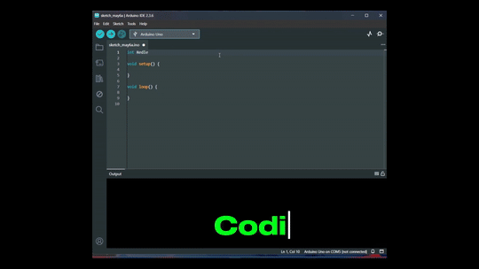

# LED-Responder 123

## Full Control. No Mistakes. No Mercy.

**Project # 7** in the embedded arsenal. This ain’t just “light up when pressed.” This is **state control**. Lock in one LED. Lock out the others. No multitasking. No chaos. Reset is your only escape.

---

## 🧭 Why This Matters

**Real-time systems** demand clarity. When one system is active, others wait. This isn’t multitasking — this is **prioritized response**. If you can’t control a few LEDs with discipline, forget controlling motors, sensors, or a whole robot. This teaches **single-state dominance**.

### ⚙️ What I Learned

- `digitalRead()` to sense input like a sniper  
- `while()` locks logic tight — no bouncing out  
- `digitalWrite()` for precise output control  
- Hardware reset button = kill switch mentality  
- Structure your logic like a machine — not a maybe

---

## 🔩 Parts I Used

- Arduino Uno (or compatible)  
- 3x LEDs (Red, Yellow, Green)  
- 3x 220Ω Resistors  
- 4x Pushbuttons (3 input, 1 reset)  
- Jumper wires  
- Breadboard  

---
## 📈 Schematic


---

## 🛠️ Wiring


---

## 👨‍💻 The Code

```cpp
// Pin assignments for LEDs
int Redled = 8;
int Yellowled = 7;
int Greenled = 6;

// Pin assignments for buttons
int Key1 = 5;
int Key2 = 4;
int Key3 = 3;
int KeyRest = 2;

// Variables to store button states
int Red;
int Yellow;
int Green;

void setup() {
  pinMode(Redled, OUTPUT);
  pinMode(Yellowled, OUTPUT);
  pinMode(Greenled, OUTPUT);

  pinMode(Key1, INPUT);
  pinMode(Key2, INPUT);
  pinMode(Key3, INPUT);
  pinMode(KeyRest, INPUT);
}

void loop() {
  Red = digitalRead(Key1);
  Yellow = digitalRead(Key2);
  Green = digitalRead(Key3);

  if (Red == HIGH) Red_YES();
  if (Yellow == HIGH) Yellow_YES();
  if (Green == HIGH) Green_YES();
}

void Red_YES() {
  while (digitalRead(KeyRest) == LOW) {
    digitalWrite(Redled, HIGH);
    digitalWrite(Greenled, LOW);
    digitalWrite(Yellowled, LOW);
  }
  clear_led();
}

void Yellow_YES() {
  while (digitalRead(KeyRest) == LOW) {
    digitalWrite(Redled, LOW);
    digitalWrite(Greenled, LOW);
    digitalWrite(Yellowled, HIGH);
  }
  clear_led();
}

void Green_YES() {
  while (digitalRead(KeyRest) == LOW) {
    digitalWrite(Redled, LOW);
    digitalWrite(Greenled, HIGH);
    digitalWrite(Yellowled, LOW);
  }
  clear_led();
}

void clear_led() {
  digitalWrite(Redled, LOW);
  digitalWrite(Greenled, LOW);
  digitalWrite(Yellowled, LOW);
}

```

---

## 🧠 The Concept
This project is about discipline under input pressure. One button. One response. Everything else waits. It's your first taste of state-driven embedded control.

- No multitasking.
- No “kind of works.”
- You either control the system or the system controls you.

## 🎬 Final Result

- Press Red → Red LED locks ON
- Press Yellow → Yellow LED locks ON
- Press Green → Green LED locks ON
- Press Reset → All OFF


## Full Video Here: [youtu.be/RBC4ETXTI1M](https://www.youtube.com/watch?v=RBC4ETXTI1M)


